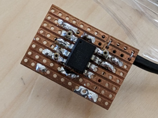
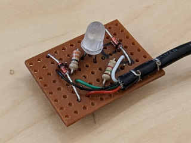

Old project that was re-discovered in a drawer recently. 
Used to have a flashing dragon in the office when builds failed :)

Running on a ATTiny45 (4Kb flash, 256 bytes ram) using [V-USB](https://www.obdev.at/products/vusb/index.html).

The go-test is new, and was mostly just to play with the go-usb module. 

